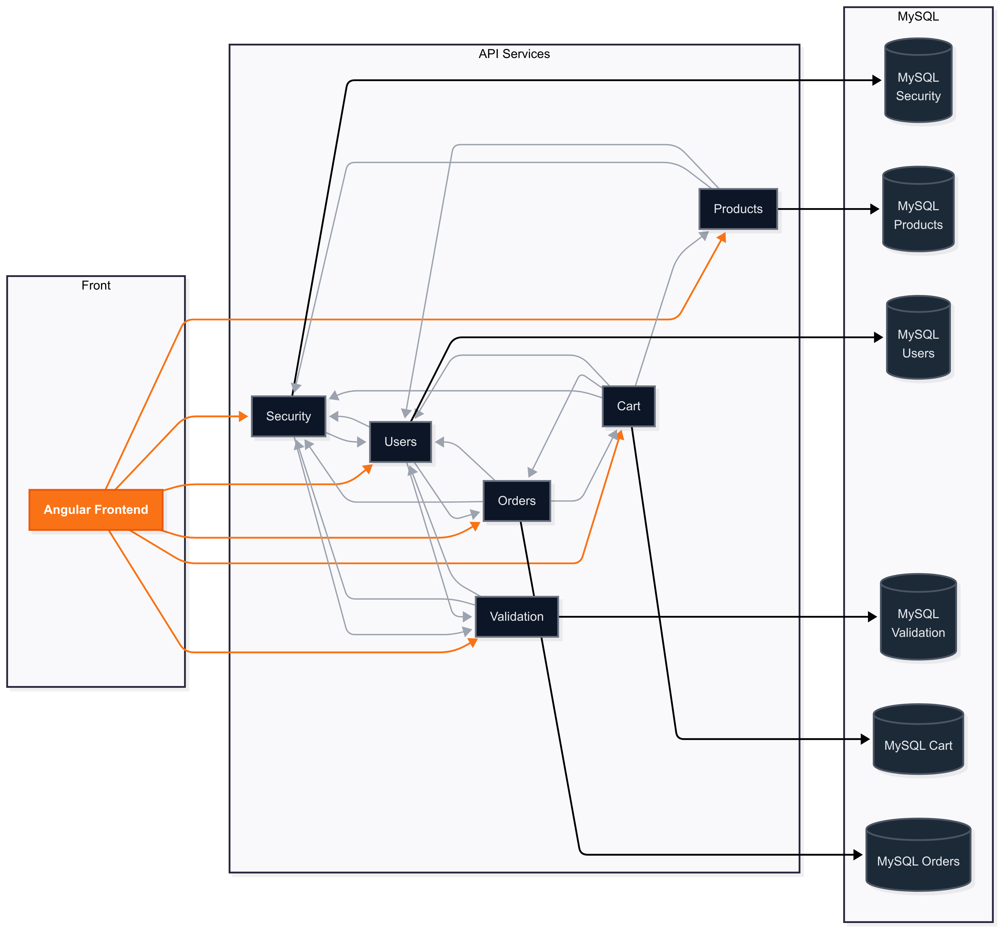

# Studi Jeux-Olympiques


## Manuel d’utilisation

---

## 1. Introduction

Ce projet est une application réalisée dans le cadre d'une évaluation de fin de formation Bachelor Développeur d'Applications.

Autour du thème des Jeux Olympiques, cette plateforme permet :
- de découvrir les événements sportifs,
- d’acheter des e-billets en ligne,
- et d’administrer la plateforme via un gestionnaire de contenu.

L’architecture repose sur :
- 6 micro-services développés avec **Spring Boot**,
- un front-end **Angular**,
- et une orchestration complète via **Docker Compose**.



Pour simplifier le lancement de l'application, un fichier docker-compose permet de démarrer automatiquement toutes les APIs.  
Le fichier Docker inclut une base de données MySql et une interface phpMyAdmin.

**Sécurité :**
une double authentification est mise en place avec l'envoi de code par email.
> ⚠️ En mode local, les emails ne sont pas envoyés.  
> Les codes de confirmation sont affichés directement dans la console.

---

## 2. Prérequis

- **Docker** et **Docker Compose** installés
- **Node.js** + **Angular CLI** (si lancement du front séparément)
- Un terminal ou IDE compatible avec les commandes Docker

---

## 3. Installation

Cloner le projet :
```bash
git clone https://github.com/hatim37/studi-jeux-olympiques.git
cd studi-jeux-olympiques
```

---

## 4. Démarrage de l’application

Deux options sont possibles pour démarrer le projet :

---

### Option 1 — Sans tests (par défaut, rapide)

1. Construire les images :
```bash
docker-compose build
```

2. Lancer tous les services :
```bash
docker-compose up
```

---

### Option 2 — Avec tests Maven

1. Construire les images en activant les tests :
```bash
docker-compose build --build-arg SKIP_TESTS=false --no-cache
```
> `--no-cache` force la reconstruction complète et exécute les tests.

2. Lancer tous les services :
```bash
docker-compose up
```

---

## 5. Accéder au front

- Application front disponible à :  
  [http://localhost:8080](http://localhost:8080)

---

## 6. Accéder à la base de données

- Interface phpMyAdmin disponible à :  
  [http://localhost:8081](http://localhost:8081)

> ⚠️ Aucun mot de passe requis pour la connexion locale.

---

## 7. Compte administrateur

Un compte admin est créé automatiquement au démarrage.

- **Identifiant** : `admin@admin.com`
- **Mot de passe** : `Studi1234`

---

## 8. Développement et tests

### 8.1 Profils disponibles
- **Local** : démarrage individuel de chaque API dans Spring Boot.
- **Docker** : démarrage groupé via `docker-compose`.
- **Cloud** : configuration prête pour déploiement sur Google Cloud.

### 8.2 Modifier le code et relancer
```bash
docker-compose down
# modifier le code...
docker-compose build --build-arg SKIP_TESTS=false
docker-compose up
```

### 8.3 Lancer le front séparément
```bash
cd frontend-angular
npm install
ng serve
```

Accessible sur [http://localhost:4200](http://localhost:4200)

---

## 9. Bonnes pratiques

- Consulter les logs :
```bash
docker-compose logs -f
```

- Arrêter tous les services :
```bash
docker-compose down
```

- Rebuild avec tests :
```bash
docker-compose build --build-arg SKIP_TESTS=false --no-cache
```

---

## 10. FAQ / Problèmes fréquents

**Q : `docker-compose` se fige au démarrage**
- L’ordre normal de démarrage est `mysql-db` => `orders-service`.
- Vérifiez que le port 3306 est libre et qu’aucun serveur local (WAMP/XAMPP) n’est actif.
- Appuyez sur une touche puis relancez :
```bash
docker-compose up
```

**Q : Le front ne s’affiche pas ?**
- Vérifiez que le port `8080` n’est pas occupé.
- Vérifiez que le container Angular est bien lancé :
```bash
docker ps
```

**Q : Les emails ne fonctionnent pas ?**
- Comportement normal en local : les codes sont visibles dans la console.

---

## 11. Conclusion

Ce projet est conçu pour un **démarrage simple et rapide via Docker** :
1. **Sans tests** : idéal pour une utilisation rapide.
2. **Avec tests** : exécution complète des tests Maven avant déploiement.


---

## 12. Remerciements

Un grand merci à toute l’équipe pédagogique de **Studi** pour leur implication, leur patience et la qualité des enseignements qui ont rendu ce projet possible.

---
